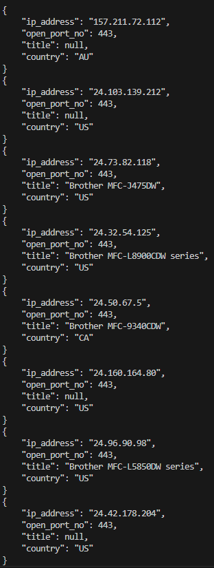

# Printer 🖨️ 

## Overview
***criminalip_printer.py*** is a python program that retrieves *printer* related assets(e.g. IP, Port, Title, Country) using criminal ip banner search api

## Prerequisites
Get Criminal IP API Key from [criminalip.io](criminalip.io).
You have to sign up, but the api key itself is free upon creating your account.

## Installation and Setup / Usage
Put the api key value that you got from criminal ip, to the variable ```x-api-key``` in the ```criminalip_printer.py``` file

> [!TIP]
> If you have additional criminal ip search queries that you want to use, you can manually add them by putting them to the ```QUERY_LIST```

## How to get started
Execute the file ```criminalip_printer.py```

## Screenshot


<details open>
  <summary><i>Extra Tips</i></summary>
  By default, the offset value of base_url is limited to max of "100".
  If you want more IP and Port information, you can reset the limit value. </details>

----

Hope you enjoy!
